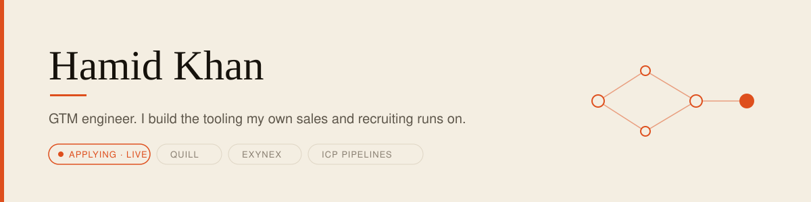
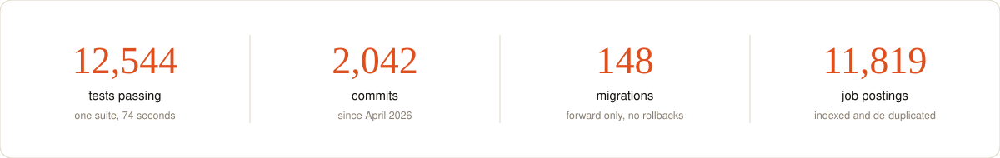
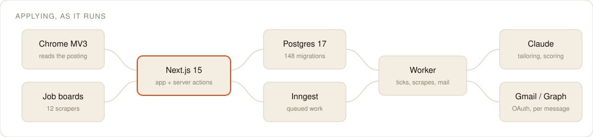
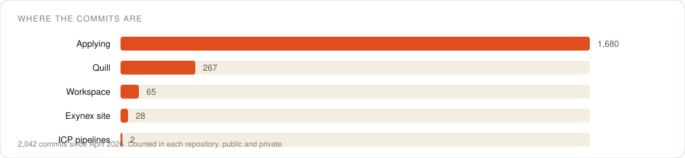

<picture>
  <source media="(prefers-color-scheme: dark)" srcset="./assets/hero-dark.svg">
  
</picture>

I work on go to market: outbound, pipeline, hiring. Then I build the tooling that work runs on, which means I am the first person every bad decision reaches. A reminder that fires with nothing to do, a button that does nothing when pressed, a deploy that reports success and ships the previous commit: I find those by using the thing, usually at the worst moment. That is most of what shapes it.

Everything below is live or in daily use. Nothing here is a tutorial project.

<picture>
  <source media="(prefers-color-scheme: dark)" srcset="./assets/metrics-dark.svg">
  
</picture>

---

## What is running

| Project | What it does | State |
|---|---|---|
| **[Applying](https://applying.exynex.com)** | Job search operations end to end: twelve board scrapers, a CV tailored per role, funnel tracking from discovered to offer, and a Chrome extension that records an application against the posting you are reading. | **Live** · 1,680 commits |
| **Quill** | LinkedIn outreach, headless in the cloud, with an optional local engine. Claude and Gemini draft, a person approves. | Running · 267 commits |
| **ICP pipelines** | Apollo and n8n workflows that build per-client prospect lists into the Sheets the sales side already works in. | In use |
| **Exynex site** | 41 static pages, assembled by shell script, served from Cloudflare. | Live |

Most of these repositories are private, because they hold live prospect and candidate data.

---

## How Applying is put together

<picture>
  <source media="(prefers-color-scheme: dark)" srcset="./assets/system-dark.svg">
  
</picture>

Two deployment targets on one box, as separate Docker compose projects. The web build runs on the server from `origin`, so an unpushed commit deploys the previous one and still exits zero. I check the hash, never the exit code.

---

## Stack

**Language and runtime**
 

**Application**
 

**Data and background work**
 

**Testing and delivery**
 

**Models**
 

Queued work runs on **Inngest** in the cloud and **pg-boss** locally. Browser automation and end to end both run on **Playwright**.

One tool per job. No list of four queues I have touched once.

---

## Four things the work taught me

**A deploy that exits zero is not a deploy.** The build runs on the server from `origin`. An unpushed commit ships the previous one and still reports success. Confirm by hash.

**Lint passing is not the build passing.** `next build` runs its own stricter pass. Zero lint errors locally still failed a deploy twelve minutes in, over eight `require()` calls in test files.

**A feature on the wrong route passes every test of itself.** Follow ups were attached to one submit function while production used a different one. 873 submissions produced zero reminders, and the suite was green the whole time. Now I grep for everything that writes the column, not everything that calls the function.

**A screenshot shows the resting state.** Almost every interface fault that reached me was in a state a still image cannot hold: a menu that had to be opened, a chip that had to be pressed, a button whose label changed width and shoved its neighbour. Building it and looking at it is not finishing it.

---

## Where the work is

<picture>
  <source media="(prefers-color-scheme: dark)" srcset="./assets/commits-dark.svg">
  
</picture>

Twelve of my fourteen repositories are private, because they hold live prospect and candidate data. Every figure above was counted in the repository itself rather than read off a card, which only sees the public two.

---

## Reach me

**[hamidcheema94@gmail.com](mailto:hamidcheema94@gmail.com)**

If you want to see the private work, ask and I will walk you through it.
